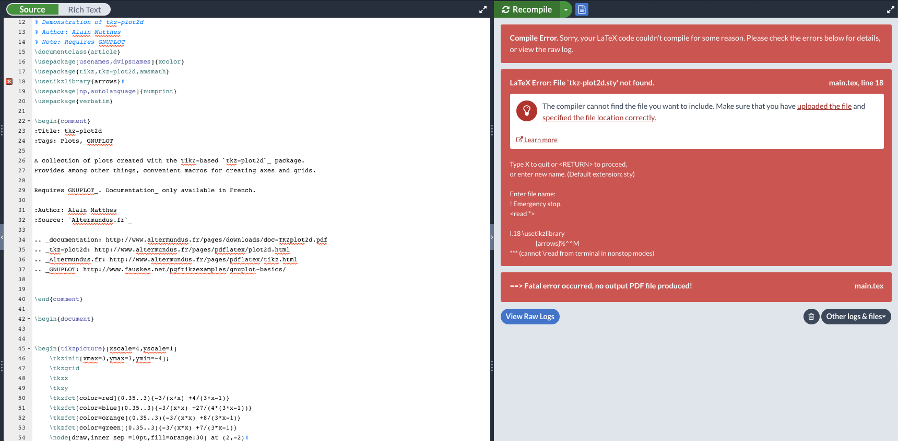
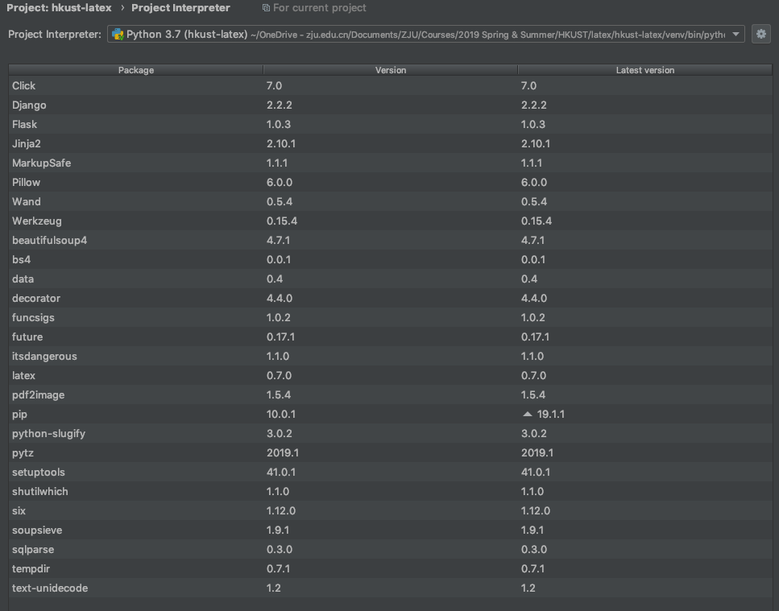

# Latex Crawler, Compiler & Search Engine

## Introduction
This is a project for the coding task required by a team at HKUST for a summer intern interview.

## Requirments
The requirements is at the [coding-task.pdf](coding-task.pdf)

## Demonstration
This is a simple local demonstration  
Following is the index page 

 
This is a page for a specific tag.

  
## Issues
1. As you can see in [data/log.txt](data/log.txt), there are some issues finding the correct *.sty files, 
 this is because of a lack of dependencies. I used MacTex to compile all the files and most of these
 really well. I think this is not the only issue with my compiler, as you can see in the following photo, 
 these latex files won't compile at overleaf platform as well.
  
  

## TODO
1. A support for multi-page .pdf file conversion to .png file, currently, only the last page of the .pdf
 file is saved as a .png file.
2. A .png border cropper that crops out all the blank area of the .png file, the current one only works well
 partially.
3. Prettify the front-end, the images should be with captions and .css files should be included in static to
 make sure that the pages are correctly styled and the images are scaled properly.

## Dependencies
1. [MacTex](https://tug.org/mactex/mactex-download.html) running on Mac OS X
2. Relative Python packages as following. (A screen-shot from PyCharm Package Manager)

 
## Liscence
MIT