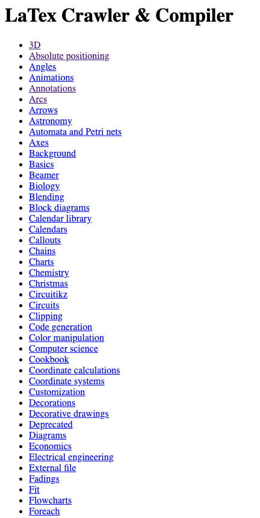
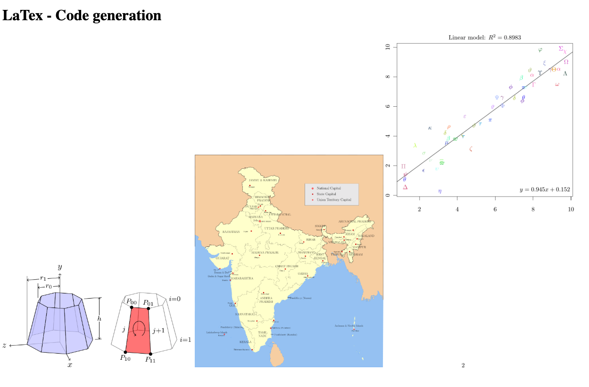

# Latex Crawler, Compiler & Web Application 

## Introduction
This is a project for the coding task required by a team at HKUST for a summer intern interview.

## Requirments
The requirements is at the [coding-task.pdf](coding-task.pdf)

## Task Solution
### Demonstration
This is a simple local demonstration  
Following is the index page 

 
This is a page for a specific tag.

  
### Issues
1. As you can see in [data/log.txt](data/log.txt), there are some issues finding the correct *.sty files, 
 this is because of a lack of dependencies. I used MacTex to compile all the files and most of these
 really well. I think this issue is not only with my compiler, as you can see in the following photo, 
 these latex files won't compile at overleaf platform as well.
  
  

### TODO
1. A support for multi-page .pdf file conversion to .png file, currently, only the last page of the .pdf
 file is saved as a .png file.
2. A .png border cropper that crops out all the blank area of the .png file, the current one only works well
 partially.
3. Prettify the front-end, the images should be with captions and .css files should be included in static to
 make sure that the pages are correctly styled and the images are scaled properly.
4. Deployment: deploy the application to a Linux cloud server that runs as a web application.

### Dependencies
1. [MacTex](https://tug.org/mactex/mactex-download.html) running on Mac OS X
2. Relative Python packages as following. (A screen-shot from PyCharm Package Manager)

## Bonus Question
### Can you explain how this website compile latex? https://people.math.osu.edu/fowler.291/latex/

Answer: I found a main.js file in the files sent by the Node.js server, which compiles LaTex.

#### Architecture

main.js mainly imports the following functionality:
- dvi2html - converts Tex DVI file to HTML
- codemirror - a versatile text editor for web browser

As  we can see in the following block of the main.js file,
the LaTex text file is firstly converted to a Tex DVI file
using the ***tex*** function, then converted to ***html***.

The compilation result is represented as HTML with a lot of inner
CSS styles.

##### What is DVI?
A DVI file is a stream of 8-bit bytes,
 which may be regarded as a series of 
 commands in a machine-like language.
 More details can be found at 
 [here](https://github.com/tmanderson/dvi-parser/wiki/DVI-Specification-Explained).

### What is webassembly, how do you think about it?
Following is the official definition of webassembly.

In my own words, webassembly is a language that is generated by a
 compiler that converts other languages to a more
 web-friendly language. It makes it possible that packages in some
 of the traditional languages like C++ and C be used and interpreted for web applications,
 which greatly expands the ecosystem of JavaScript. These days, mobile
 platform is becoming more and more popular, with browsers becoming and more important,
 and webassembly will be useful in that process.
 Here, the webassembly is used for LaTex Compilation.
 
 
 ### Suppose that you are doing a recommendation to customers on a system, you have recommendation lists for customers. But how can you know/infer the ground truth of your recommendation. What will you do to improve your recommendation?
I think the learning algorithm should evolve as the customers makes
decisions on which recommendation to view and which one to buy. If the
later choices are greatly different(we can set a percentage threshold for that),
we should consider our recommendation to be wrong.

## Liscence
MIT